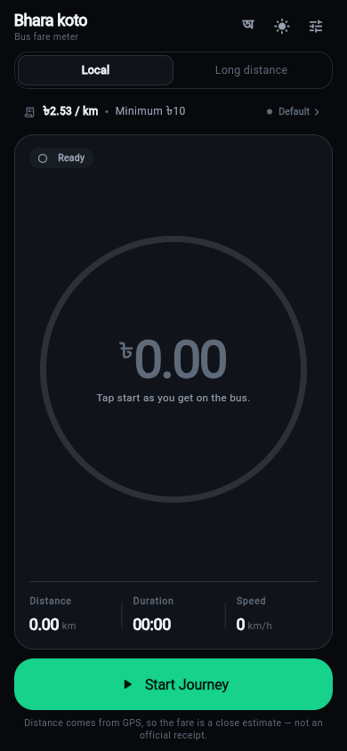
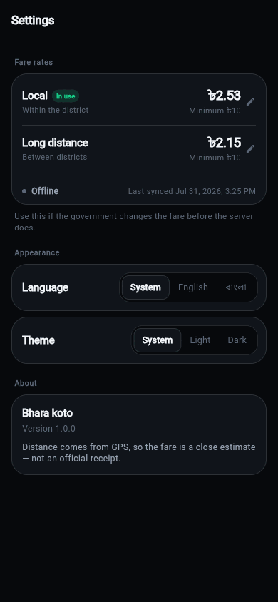

# ভাড়া কত · Bhara koto

A GPS fare meter for Bangladeshi buses. Tap **Start** as you board, and the app
measures the distance travelled, multiplies it by the official per-kilometre
rate, applies the minimum-fare floor, and shows what you should be paying.

The *rates* are not baked into the binary — they are pulled from a JSON file you
host on a GitHub Gist, so a government fare revision reaches every phone without
a new app release. (The Gist *URL* is baked in, so passengers never configure
anything.)

- Two fare tables — **Local** (within a district) and **Long distance**
  (between districts) — switched with one tap on the home screen
- Bangla and English, switchable from the home screen (numerals switch too:
  `৳২৫.৩০` / `৳25.30`)
- Light and dark themes, tuned for readability in direct sunlight
- Works fully offline on the last rates it saw
- Detects when you've stopped moving and highlights the final fare


| Meter | Settings |
| --- | --- |
|  |  |

> Not on any app store — build it yourself with the steps in
> [Running it](#5-running-it), or grab an APK from the Releases page if one is
> published.

---

## 1. The fare rules Gist

The rates live in a GitHub Gist, so a fare revision reaches every phone without
shipping a new build. The URL is **baked into the app** — passengers never see
or configure it. You edit the Gist; everyone's app follows.

The live URL is set in [`lib/utils/constants.dart`](lib/utils/constants.dart):

```dart
const String kFareRulesUrl =
    'https://gist.githubusercontent.com/MH-Nazmul/b1b9308147c33a231133805d39f2150a/raw/fare_rules.json';
```

> ⚠️ **No revision hash.** GitHub's **Raw** button gives you a URL with a commit
> hash in it (`.../raw/51d7d23e.../fare_rules.json`), which is pinned to that
> exact version and would keep serving today's rates forever. Deleting the hash
> segment — nothing between `raw/` and the filename — makes it always serve the
> newest revision. That is why the constant above looks the way it does.

### What to put in the Gist

Bangladesh charges two different per-km rates, so the file carries both:

```json
{
  "fares": {
    "local":     { "rate_per_km": 2.53, "min_fare": 10.0 },
    "intercity": { "rate_per_km": 2.43, "min_fare": 10.0 }
  },
  "version": "2026-07"
}
```

| Profile | Shown as | Meaning |
| --- | --- | --- |
| `local` | **Local** / লোকাল | Within one district — city and local routes |
| `intercity` | **Long distance** / দূরপাল্লা | Between districts — long-distance coaches |

Optional extras, all ignorable:

| Key | Meaning |
| --- | --- |
| `version` | Free-text label, e.g. `"2026-07"` — helps you spot stale rules |
| `updated_at` | ISO date, e.g. `"2026-07-01"` |
| `notice_en` / `notice_bn` | A short message shown as a banner on the home screen |

Keep these in step with the current BRTA figures — the Gist is the source of
truth, and the same numbers are mirrored as a built-in fallback in
[`lib/utils/constants.dart`](lib/utils/constants.dart) for a first launch with
no network.

### Creating one from scratch

1. Sign in at [github.com](https://github.com), go to **<https://gist.github.com>**
2. Filename box: `fare_rules.json`
3. Paste the JSON above (also in [`fare_rules.example.json`](fare_rules.example.json))
4. Click **Create public gist**
5. Click **Raw**, copy the URL, **delete the revision hash** as described above
6. Put it in `kFareRulesUrl` and rebuild

**Forking this repo?** Do exactly the above. The URL currently in
`constants.dart` points at *this project's* Gist, which only its owner can
edit — swap in your own so you control your app's rates.

> A *secret* gist works too and stays off your profile, but its raw URL is still
> readable by anyone holding the link — neither option is private.

### Changing rates later

Edit the gist, click *Update Gist*. Done — no rebuild, and nothing for the
passenger to do: the app re-reads the rules **once a day** on launch and picks
up the new numbers by itself. There is no Sync button and the URL is never
shown in the UI. The request carries a cache-busting parameter, so GitHub's CDN
can't serve a stale copy.

**Backwards compatible:** a flat `{"rate_per_km": …, "min_fare": …}` file (the
old single-rate format) is still accepted and applies to both profiles. So is a
`fares` object containing only one of the two.

---

## 2. How the meter works

`Point A → Point B → …`, summing the [Haversine](https://en.wikipedia.org/wiki/Haversine_formula)
distance between consecutive GPS fixes (`Geolocator.distanceBetween`). The app
asks for a fix roughly every 4 seconds or every 5 metres — enough for a bus,
cheap on battery.

Raw GPS is noisy, so [`TripState`](lib/state/trip_state.dart) applies three
filters before a metre counts. Without them, a phone sitting still in a traffic
jam would silently invent a kilometre of fare:

| Rule | Threshold | Why |
| --- | --- | --- |
| Discard imprecise fixes | accuracy > 40 m | A fix we don't trust isn't data |
| Ignore jitter | hop < 8 m | A parked phone wanders a few metres; the anchor point is kept, so genuine slow travel still accumulates |
| Reject teleports | implied speed > 45 m/s (162 km/h) | Tunnel / urban-canyon glitches |

**Stop detection:** no real movement for 40 seconds while speed is under
5 km/h ⇒ the trip enters the `stopped` phase, the fare gets highlighted and the
card lights up. Tracking keeps running, so if the bus pulls away the trip
resumes on its own — and *Still moving* overrules the detector manually.

**Fare:** `max(distance_km × rate_per_km, min_fare)` using the rates of the
selected bus type, rounded to two decimals at the end — see
[`lib/utils/calculator.dart`](lib/utils/calculator.dart). Switching bus type
mid-trip is allowed and simply recomputes from the distance so far.

---

## 3. Where the rates come from

The app never blocks the first frame on the network. On launch it reads local
storage synchronously, then — if the rules haven't been checked in the last 24
hours — fetches the Gist in the background. A failure is silent: the cached
numbers stay and the passenger is never shown a network error.

Fares are revised a few times a year, so a daily check is generous. The
interval is `kConfigRefreshInterval` in
[`lib/utils/constants.dart`](lib/utils/constants.dart).

The active source is always visible on the home-screen strip and in Settings:

| Badge | Meaning |
| --- | --- |
| **Server** | Rates confirmed against your Gist within the last day |
| **Offline** | Couldn't reach the Gist recently — running on the last copy saved |
| **Manual** | You typed the rates in yourself; server updates are ignored until you switch back |
| **Default** | Built-in fallback in `constants.dart` — nothing fetched or saved yet |

Manual override exists for the gap between a government fare change and you
getting round to editing the Gist. It applies **per profile** — correcting the
long-distance rate leaves the local one alone. Your manual numbers are kept on
disk, so switching back and forth is one tap.

---

## 4. Project layout

```
lib/
├── main.dart                    # Composition root: builds services, state, MaterialApp
├── models/fare_config.dart      # The shape of fare_rules.json (tolerant parser)
├── services/
│   ├── location_service.dart    # GPS permissions + tuned position stream
│   ├── config_service.dart      # HTTP fetch of the Gist, typed failures
│   └── storage_service.dart     # SharedPreferences: rates, bus type, theme, language
├── state/
│   ├── app_state.dart           # Active rates + bus type, sync status, theme, language
│   ├── trip_state.dart          # The meter: filtering, distance, stop detection
│   └── app_scope.dart           # InheritedWidget handing both to the tree
├── screens/                     # home_screen.dart, settings_screen.dart
├── widgets/                     # Small composable pieces (dial, hero, strip, pills)
├── theme/app_theme.dart         # Design tokens + light/dark ThemeData
├── utils/                       # calculator.dart, formatters.dart, constants.dart
└── l10n/                        # app_en.arb, app_bn.arb → generated AppLocalizations
```

State is two `ChangeNotifier`s passed down through one `InheritedWidget`, and
widgets subscribe with `ListenableBuilder` exactly where they need to rebuild —
so the once-a-second tick repaints the numbers, not the whole screen. No
state-management package required.

---

## 5. Running it

```bash
flutter pub get
flutter run                 # Android or iOS device
flutter test                # 30 unit + widget tests
flutter analyze             # clean
```

To edit UI text, change the `.arb` files in `lib/l10n/` and run
`flutter gen-l10n`.

### App icon

The source art lives in `assets/appIcon/`:

| File | Purpose |
| --- | --- |
| `icon.png` | 1024px master, used for the standard Android/iOS/web icons |
| `icon_foreground.png` | Android adaptive foreground, pre-inset (see below) |

Regenerate every density after changing the art:

```bash
dart run flutter_launcher_icons
```

Android 8+ masks away the outer ~34% of an adaptive icon, and the gold card in
the artwork spans ~86% of the frame — full-bleed, its corners would be shaved
off by a circular launcher mask. `icon_foreground.png` is therefore the same
art scaled down inside a transparent canvas, and the adaptive background is set
to `#121D30` to match the artwork's own outer navy so the join is invisible.

### Permissions

Already declared — you don't need to add anything:

- **Android** — `ACCESS_FINE_LOCATION`, `ACCESS_COARSE_LOCATION`, `INTERNET`,
  plus `FOREGROUND_SERVICE` / `FOREGROUND_SERVICE_LOCATION` so the meter keeps
  counting with the screen off (Android 14+ requires the latter).
- **iOS** — `NSLocationWhenInUseUsageDescription`,
  `NSLocationAlwaysAndWhenInUseUsageDescription` and the `location` background
  mode.

Location data is only ever used to compute distance on-device. Nothing is
uploaded; the only network call the app makes is the `GET` for your fare rules.

---

## 6. Accuracy caveat

Distance is the sum of straight lines between GPS samples, so it slightly
under-reads on winding routes and can drift where the signal is poor (under
flyovers, between tall buildings). Treat the number as a well-informed estimate
for checking a conductor's arithmetic — not as an official receipt.

---

## 7. License

[MIT](LICENSE) — use it, change it, ship it, commercially or not. Just keep the
copyright notice.

The fare figures in `fare_rules.example.json` are illustrative; the licence
covers the code, not the accuracy of any rate you publish with it.
